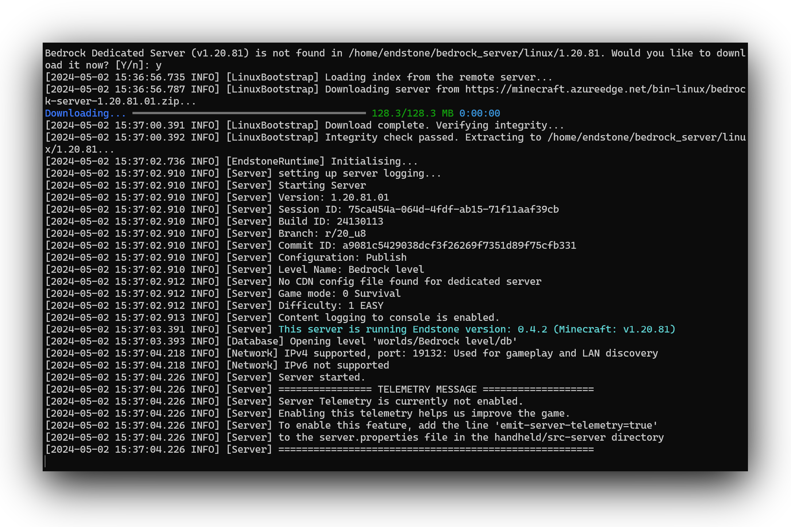

# 开启你的服务器

在你已经 [安装] 完Endstone后, 你可以启动你的服务器通过 `endstone` 的命令. 进入目录,在你所想创建服务器的目录输入

```
endstone
```

或者, 如果你在docker中运行endstone, 用以下命令:

=== ":fontawesome-brands-linux: Linux / :fontawesome-brands-windows: Powershell"

    ```
    docker run --rm -it -v ${PWD}:/home/endstone -p 19132:19132/udp endstone/endstone
    ```

=== ":fontawesome-brands-windows: Command Prompt"

    ```
    docker run --rm -it -v "%cd%":/home/endstone -p 19132:19132/udp endstone/endstone
    ```

你将能在控制台中看见以下画面:



!!! 提示
    在首次开启 [BDS] 你需要在官网下载BDS.


[安装]: installation.md

[BDS]: https://www.minecraft.net/en-us/download/server/bedrock