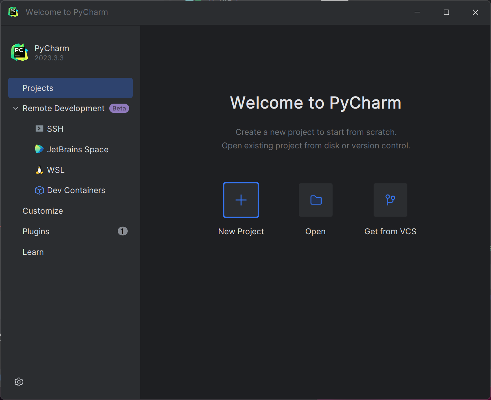
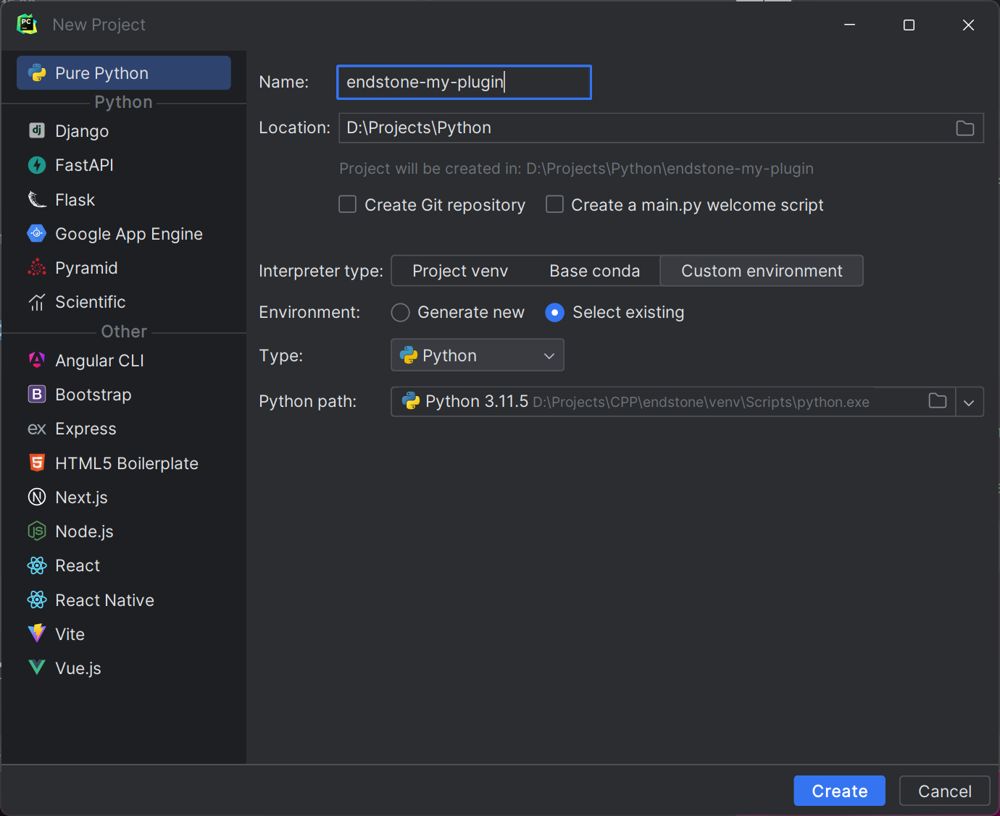
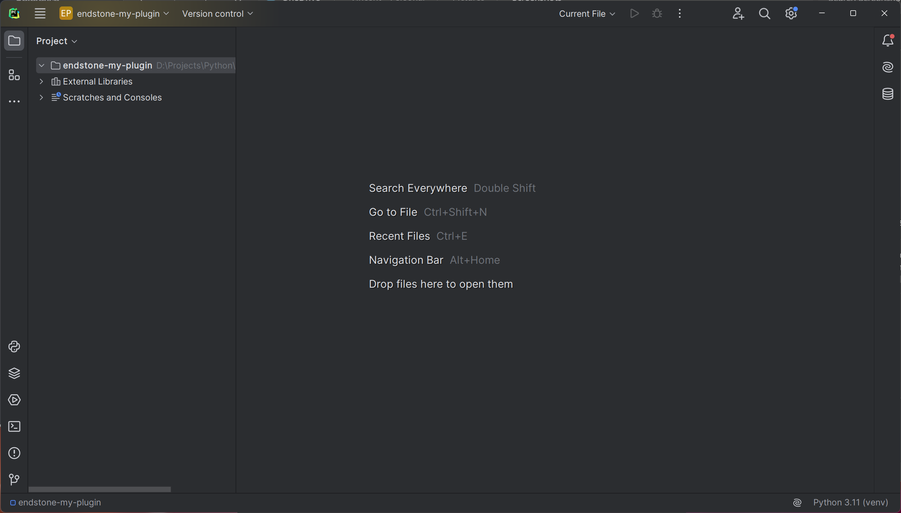
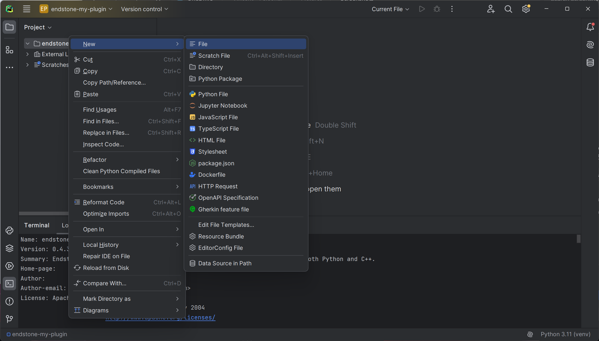
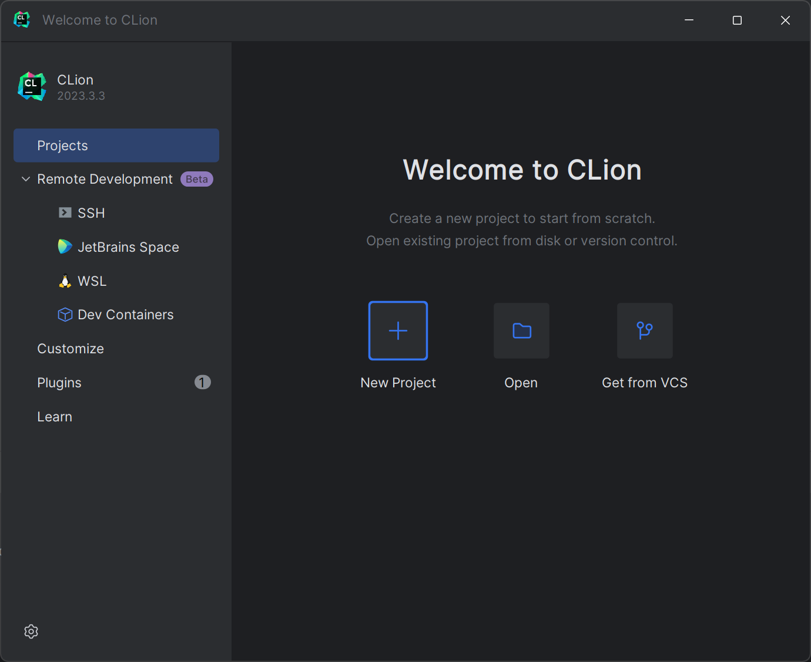
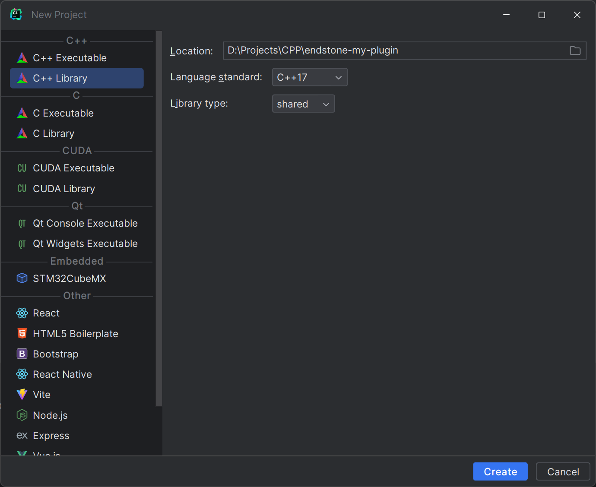
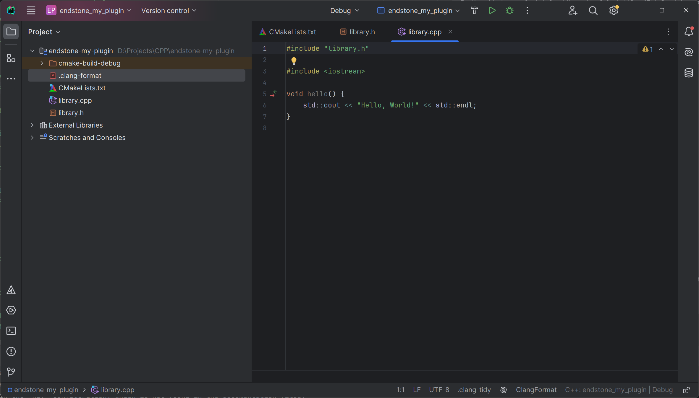
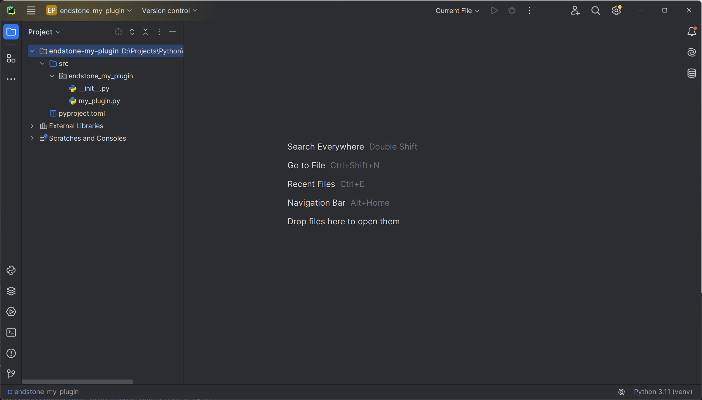
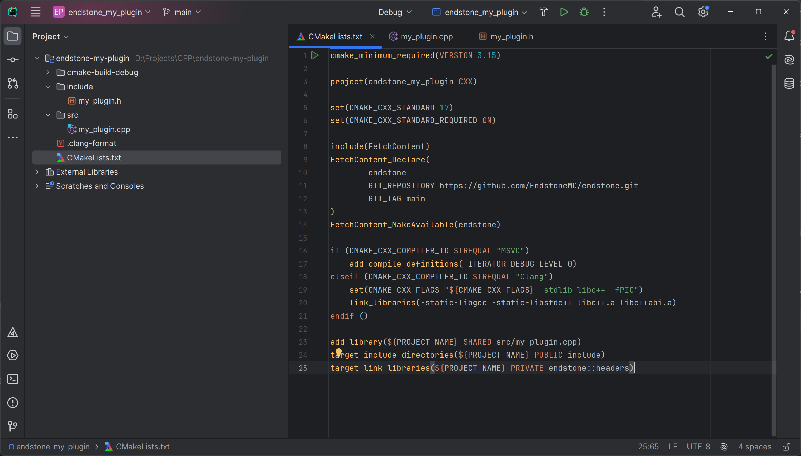

# 创建你的插件

## IDE安装

=== ":fontawesome-brands-python: Python"

    要使用 Python API 开发第一个插件，您需要满足以下条件:
    
    -   [JetBrains PyCharm 或者 Microsoft Visual Studio带有python负载]
    -   [Python] (>= 3.9)
    -   [endstone Python package]

=== ":simple-cplusplus: C++"

    要使用 Python API 开发第一个插件，您需要满足以下条件:

    -   [JetBrains CLion 或者 Microsoft Visual Studio带有CMake负载]
    -   [CMake] (>= 3.15)
    -   C++ Compiler
        -   **:fontawesome-brands-windows: Windows**: [Visual Studio] 2017 or newer
        -   **:fontawesome-brands-linux: Linux**: [LLVM Toolchain] 5 or newer with Clang and libc++

## 创建一个新项目

=== ":fontawesome-brands-python: Python"

    当你打开PyCharm你可以看见欢迎界面:

    

    点击 **New Project(新建项目)**

    

    为你的插件取名为 **MyPlugin**.在EndStone的开发中, 我们必须遵守以下的命名规范:

    1. 项目名称使用带破折号的小写字母
    2. 以 “endstone-”作为项目名称的前缀

    因此,应在 **Name** 字段中输入 `endstone-my-plugin` 的名称.(不这样写也拦不了你(雾

    然后在 **Interpreter type**,选项中选择**Custom environment**. 选择 **Select existing**, 并将路径设置为 
    你先前安装 “endstone ”的位置,如前面条件中所述.
    最后点击 **Create**. PyCharm 工作区将展示出以下内容.

    

    !!! 提示
        EndStone需要Python安装到一个环境中.强烈建议安装一个虚拟环境?!(原句是A virtual environment is strongly recommanded.)

    ### 检查你的依赖

    最后一步, 你需要选择`endstone` 包在你安装的地方. 现在,这是我们只需要一个简单插件的依赖项. 检查其安装情况, 点击 :octicons-terminal-16: 图标:
    ```
    pip show endstone
    ```

   你将会看到像这样的东西:
    ```
    Name: endstone
    Version: 0.4.2
    Summary: Endstone offers a plugin API for Bedrock Dedicated Servers, supporting both Python and C++.
    Home-page:
    Author:
    Author-email: Vincent Wu <magicdroidx@gmail.com>
    License: Apache License
    ```

    ### 创建 `pyproject.toml`

    Modern Python packages can contain a `pyproject.toml` file, first introduced in [PEP 518]. This file contains build 
    system requirements and information, which are used by pip to build the package.
    
    Now, right click on the project folder and select **New > File** to create a `pyproject.toml`. 

        

    Copy the following content and paste into the file.
    ``` toml title="pyproject.toml" linenums="1"
    [build-system]
    requires = ["hatchling"]
    build-backend = "hatchling.build"
    
    [project]
    name = "endstone-my-plugin"
    version = "0.1.0"
    description = "My first Python plugin for Endstone servers!"
    ```

    !!! notice
        The name field should always be the project name. It must start with `endstone-` which is **enforced** by the 
        plugin loader. The name should also use `lower-case-with-dash` style.

=== ":simple-cplusplus: C++"

     When you start up CLion, you will see this welcome screen:

    

    Click on **New Project**

    

    In the side bar, select **C++ Library**. Select **C++ 17** for **Language standard**. 
    Select **shared** for **Library type**. Click on **Create**. The CLion workspace will pop up and you will see this.

    

    ### File structure
    From the project view in the side bar, you will notice that CLion created a few files for us.

    -   `.clang-format`: The configuration file for ClangFormat
    -   `CMakeLists.txt`: The manifest file for CMake build system
    -   `library.cpp`: Source file
    -   `library.h`: Header file
    
    **Delete** `library.cpp` and `library.h` as we don't need them. You can keep the `.clang-format` and 
    `CMakeLists.txt`.

    ### Update `CMakeLists.txt`

    Now, open the `CMakeLists.txt` in the side bar and delete all the existing content. 
    Then, copy and paste the following into your `CMakeLists.txt`.

    ``` CMake title="CMakeLists.txt" linenums="1"
    cmake_minimum_required(VERSION 3.15)
    
    project(my_plugin CXX)
    
    set(CMAKE_CXX_STANDARD 17)
    set(CMAKE_CXX_STANDARD_REQUIRED ON)
    
    include(FetchContent)
    FetchContent_Declare(
        endstone
        GIT_REPOSITORY https://github.com/EndstoneMC/endstone.git
        GIT_TAG main #(1)!
    )
    FetchContent_MakeAvailable(endstone)
    ```

    1.  :warning: This will use the latest development version of Endstone. Consider use a release tag (e.g. `v0.4.0`) instead of `main`.
    
    [JetBrains CLion]: https://www.jetbrains.com/clion/

## Create the main plugin class

=== ":fontawesome-brands-python: Python"

    Now, right click on the project folder and select **New > Directory** to create a `src` directory. 

    Right click on the `src` directory you just created and select **Mark Directory as > Sources Root**. You will notice
    the colour of the icon changes to blue.

    Right click again on the `src` directory and select **New > Python Package** to create a package for our plugin. 
    Since my project name is `endstone-my-plugin`, I will name the package `endstone_my_plugin`.
    
    You should have something similar to this:

    
    
    !!! tip
        For Python packages, it is a common practice to use `lower-case-with-dash` for project name and 
        `lower_case_with_underscore` for the package name. See [PEP 8] for the style guide for Python.

    Right click on the package you just created and select **New > Python File** to create a `my_plugin.py`. Create a
    class named `MyPlugin` which extends the `Plugin` class from `endstone.plugin`.

    ``` python title="src/endstone_my_plugin/my_plugin.py" linenums="1" 
    from endstone.plugin import Plugin

    class MyPlugin(Plugin):
        pass
    ```

    Then, open the `__init__.py` under the same folder and import the `MyPlugin` class from the Python file and add it 
    to the `__all__` variable.

    ``` python title="src/endstone_my_plugin/__init__.py" linenums="1"
    from endstone_my_plugin.my_plugin import MyPlugin

    __all__ = ["MyPlugin"]
    ```

=== ":simple-cplusplus: C++"

    Now, create two files: `src/my_plugin.cpp` and `include/my_plugin.h`.

    Open `CMakeLists.txt` and add a new target.

    ``` CMake title="CMakeLists.txt" linenums="1" hl_lines="16"
    cmake_minimum_required(VERSION 3.15)
    
    project(my_plugin CXX)
    
    set(CMAKE_CXX_STANDARD 17)
    set(CMAKE_CXX_STANDARD_REQUIRED ON)
    
    include(FetchContent)
    FetchContent_Declare(
        endstone
        GIT_REPOSITORY https://github.com/EndstoneMC/endstone.git
        GIT_TAG main
    )
    FetchContent_MakeAvailable(endstone)

    endstone_add_plugin(${PROJECT_NAME} src/my_plugin.cpp)
    ```

    You should have something similar to this:

    

    Open `include/my_plugin.h` and add a new class `MyPlugin` which extends the `endstone::Plugin` class.

    ``` c++ title="include/my_plugin.h" linenums="1" 
    #include "endstone/plugin/plugin.h"

    class MyPlugin : public endstone::Plugin {};
    ```

    Then, in `src/my_plugin.cpp`, include the header file.

    ``` c++ title="src/my_plugin.cpp" linenums="1"
    #include "my_plugin.h"
    ```

## Add methods

=== ":fontawesome-brands-python: Python"

    Now we want to override a few methods from the base class:
    
    - `on_load`: this will be called when the plugin is loaded by the server
    - `on_enable`: this will be called when the plugin is enabled
    - `on_disable`: this will be called when the plugin is disabled (e.g. during server shutdown)

    You can use the logger to log a message when the plugin is loaded, enabled and disabled like below:

    ``` python title="src/endstone_my_plugin/my_plugin.py" linenums="1" hl_lines="4-5 7-8 10-11"
    from endstone.plugin import Plugin

    class MyPlugin(Plugin):
        def on_load(self) -> None:
            self.logger.info("on_load is called!")

        def on_enable(self) -> None:
            self.logger.info("on_enable is called!")

        def on_disable(self) -> None:
            self.logger.info("on_disable is called!")
    ```

=== ":simple-cplusplus: C++"

    Now we want to override a few methods from the base class:
    
    - `onLoad`: this will be called when the plugin is loaded by the server
    - `onEnable`: this will be called when the plugin is enabled
    - `onDisable`: this will be called when the plugin is disabled (e.g. during server shutdown)

    You can use the logger to log a message when the plugin is loaded, enabled and disabled like below:

    ``` c++ title="include/my_plugin.h" linenums="1" hl_lines="4-8 10-13 15-18"
    #include "endstone/plugin/plugin.h"

    class MyPlugin : public endstone::Plugin {
    public:
        void onLoad() override
        {
            getLogger().info("onLoad is called");
        }
    
        void onEnable() override
        {
            getLogger().info("onEnable is called");
        }
    
        void onDisable() override
        {
            getLogger().info("onDisable is called");
        }
    };
    ```

## Configure plugin metadata

=== ":fontawesome-brands-python: Python"

    Now, the plugin is almost finished. Let's tell the server about our compatible API version.

    ``` python title="src/endstone_my_plugin/my_plugin.py" linenums="1" hl_lines="4"
    from endstone.plugin import Plugin

    class MyPlugin(Plugin):
        api_version = "0.4"

        def on_load(self) -> None:
            self.logger.info("on_load is called!")

        def on_enable(self) -> None:
            self.logger.info("on_enable is called!")

        def on_disable(self) -> None:
            self.logger.info("on_disable is called!")
    ```
    
    Lastly, to have the plugin discoverable by the server, you must specify an entry point in `pyproject.toml`.

    ``` toml title="pyproject.toml" linenums="1" hl_lines="10-11"
    [build-system]
    requires = ["hatchling"]
    build-backend = "hatchling.build"
    
    [project]
    name = "endstone-my-plugin"
    version = "0.1.0"
    description = "My first Python plugin for Endstone servers!"

    [project.entry-points."endstone"]
    my-plugin = "endstone_my_plugin:MyPlugin"
    ```

    !!! notice
    
        For the entry point, the name **must** be the name of your project **without** the `endstone-` prefix. For example,
        our project name is `endstone-my-plugin` so the entry point's name should be `my-plugin`. The value is simply 
        `{module}:{class}`.

=== ":simple-cplusplus: C++"

    Now, the plugin is almost finished. Let's tell the server about our name, version, main class and the description.

    ``` c++ title="src/my_plugin.cpp" linenums="1" hl_lines="3-6"
    #include "my_plugin.h"

    ENDSTONE_PLUGIN(/*(1)!*/"my_plugin", /*(2)!*/"0.1.0", /*(3)!*/MyPlugin)
    {
        description = "My first C++ plugin for Endstone servers";
    }
    ```

    1.  :abc: This is the plugin name!
    2.  :hash: This is the plugin version!
    3.  :white_check_mark: This is the main class of the plugin!

    !!! notice
        
        For plugin name, it must contains **only** lowercase letters, numbers and underscores.

[JetBrains PyCharm]: https://www.jetbrains.com/pycharm/

[JetBrains CLion]: https://www.jetbrains.com/clion/

[Python]: https://www.python.org/downloads/

[endstone Python package]: ../getting-started/installation.md#with-pip

[CMake]: https://cmake.org/

[PEP 8]: https://peps.python.org/pep-0008/

[PEP 518]: https://peps.python.org/pep-0518/

[Visual Studio]: https://visualstudio.microsoft.com/

[LLVM Toolchain]: https://apt.llvm.org/
